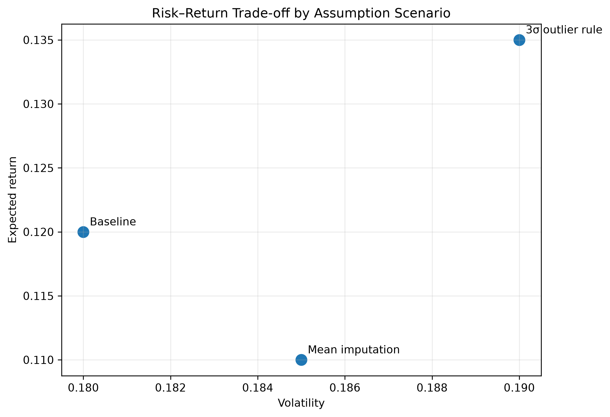
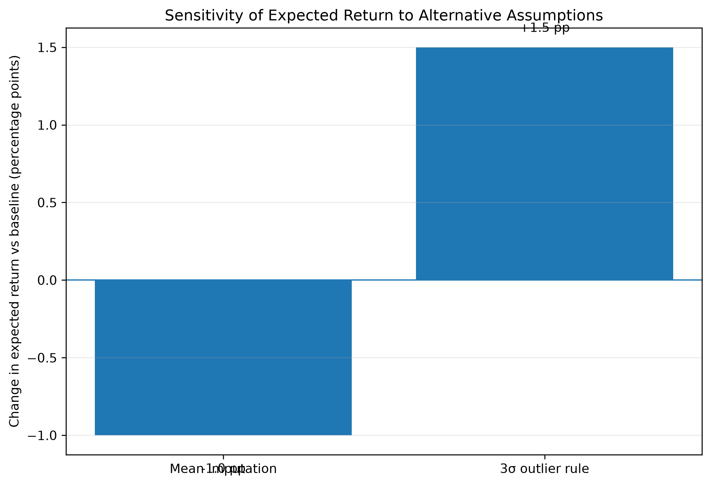
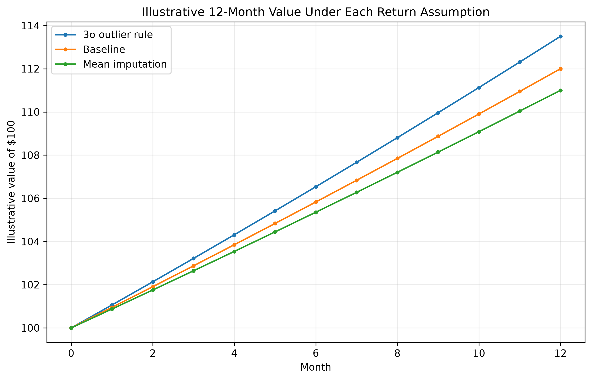

# Final Stakeholder Report — Results & Decision Implications

**Audience:** Portfolio / Risk Manager
**Decision:** Whether the baseline result is robust enough for planning and how much assumption sensitivity should be carried into the decision.

## Executive Summary

- **Use the baseline as the planning case:** expected return is **12.0%**, volatility **18.0%**, and Sharpe **0.56**.
- **Carry a sensitivity range, not a single-point forecast:** expected return shifts from **11.0% to 13.5%** across the two alternative assumptions.
- **Do not treat the higher-return outlier scenario as a free improvement:** it also increases volatility, and removing extreme observations can hide economically important stress.

## 1. Risk–Return Trade-off

**What it shows.** The baseline sits between the two alternatives. Mean imputation produces slightly lower expected return and slightly higher volatility. The 3σ outlier rule produces higher expected return, but also the highest volatility.

**What it means.** The ranking is not purely “more return is better.” The outlier scenario is more optimistic but also riskier.

**Limitation.** These are scenario outputs under different assumptions, not guaranteed future outcomes.

## 2. Sensitivity to Assumptions

| Scenario | Return | Volatility | Sharpe | Return Δ | Volatility Δ | Sharpe Δ |
|---|---:|---:|---:|---:|---:|---:|
| Baseline | 12.0% | 18.0% | 0.56 | 0.0 pp | 0.0 pp | 0.00 |
| Mean imputation | 11.0% | 18.5% | 0.49 | -1.0 pp | +0.5 pp | -0.07 |
| 3σ outlier rule | 13.5% | 19.0% | 0.61 | +1.5 pp | +1.0 pp | +0.05 |

**What it means.** The baseline conclusion is moderately robust, but not assumption-free. Mean imputation worsens the risk–return profile; the 3σ rule improves return and Sharpe while increasing volatility.

## 3. Economic Size of the Difference

**What it shows.** If each scenario’s annual return accrued smoothly, $100 would end near $111.00, $112.00, or $113.50 after one year.

**What it means.** The assumption choice is economically meaningful, but the difference is measured in a few dollars per $100 over a year—not an order-of-magnitude change.

**Limitation.** This is an illustrative compounding path, not a monthly market forecast.

## Assumptions & Risks

- Scenario metrics are assumed to use the same horizon and calculation methodology.
- Mean versus median imputation can change model outputs when missing observations are not representative.
- A 3σ outlier rule may remove genuine stress observations and understate tail risk.
- Historical risk–return relationships may change over time.
- Sharpe ratio compresses risk into one number and can hide asymmetric downside behavior.
- The scenario values are estimates; small differences should not be treated as certain outcomes.

## What This Means for You

1. **Use the baseline for planning**, not the most optimistic scenario.
2. **Communicate expected return as a sensitivity range of roughly 11.0%–13.5%.**
3. **Review any preprocessing change that moves expected return by more than about 1–1.5 percentage points or reverses scenario ranking.**
4. **Do not remove extreme observations automatically**; confirm whether they are data errors or genuine risk events.
5. Before deployment, add downside-risk metrics and validate the result on unseen data or with resampling.

## Bottom Line

The analysis supports the baseline as a reasonable decision anchor, but the exact expected return depends on preprocessing assumptions. The decision is **robust in direction but sensitive in magnitude**. Stakeholders should act on the baseline while explicitly carrying the alternative scenarios as a risk range.
