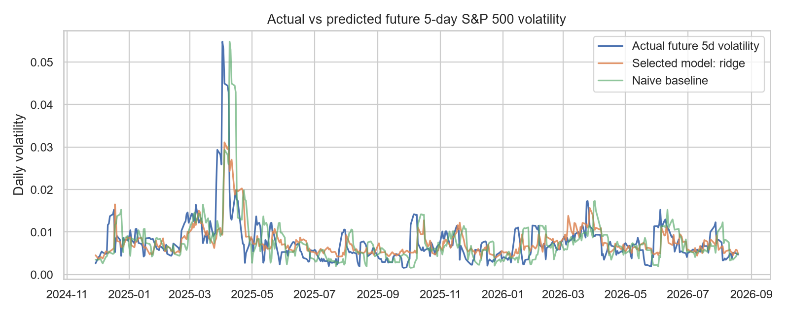
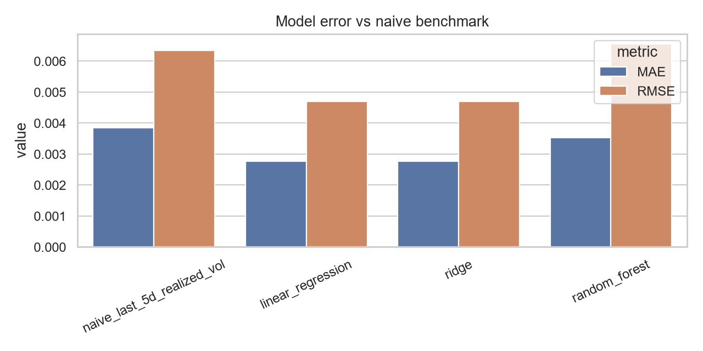
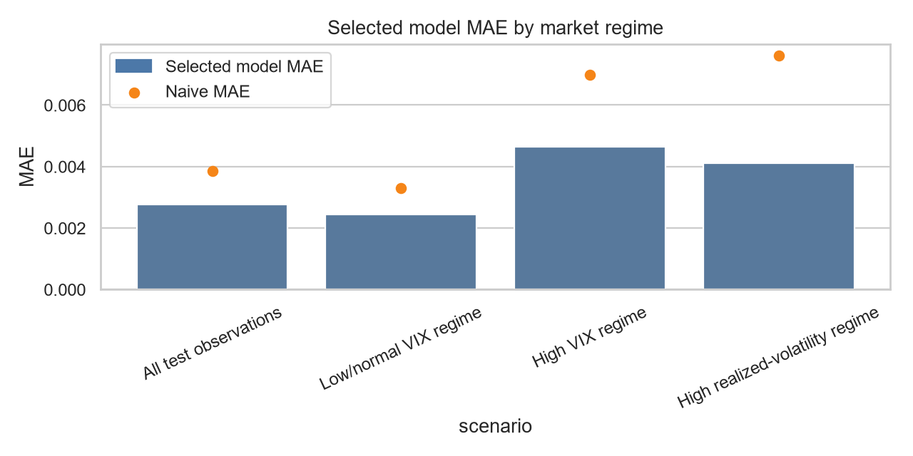

# Volatility Risk Forecast Report

Audience: Portfolio manager / risk manager

## Executive Summary

- The selected model is **ridge**, evaluated on a chronological holdout period against a naive last-observed-volatility benchmark.
- Test MAE improvement versus naive is **28.0%** and RMSE improvement is **26.1%**.
- The tool is useful as a risk-monitoring aid, not an automated trading system. It should trigger human review when predicted volatility is elevated.

## Key Charts

This chart compares realized future five-day volatility with the model forecast and the naive persistence baseline. It shows whether the model follows the broad volatility regime without claiming exact day-by-day precision.

The benchmark comparison is the main practical test: the project should improve over the risk manager's simple fallback of assuming recent volatility persists.

Regime performance matters because a risk model that works only in calm markets is less useful to a portfolio manager.

## Assumptions and Risks

- Inputs are daily close-based market indicators available at the prediction date close.
- Treasury yield reporting gaps are forward-filled across market dates; this is reasonable for short holiday gaps but can understate data staleness risk.
- Extreme market observations are retained and flagged rather than deleted because stress periods are decision-relevant.
- The model is predictive, not causal. Coefficients or feature importance should not be read as proof that an input caused volatility.
- Financial regimes change; performance should be monitored with rolling errors and stress-regime diagnostics.

## Sensitivity and Uncertainty

Bootstrap selected-model MAE estimate: **0.002774**, 95% CI **[0.002426, 0.003127]** using 1,000 resamples of test residual errors.

Scenario comparison:

| scenario | n | selected_MAE | naive_MAE | MAE_improvement_vs_naive | selected_bias |
| --- | --- | --- | --- | --- | --- |
| All test observations | 430 | 0.002774 | 0.003855 | 28.0% | 0.000168 |
| Low/normal VIX regime | 366 | 0.002446 | 0.003308 | 26.1% | 0.000322 |
| High VIX regime | 64 | 0.004652 | 0.006982 | 33.4% | -0.000713 |
| High realized-volatility regime | 85 | 0.004098 | 0.007612 | 46.2% | -0.000876 |

## What This Means for You

1. Use the forecast as an early-warning input for daily risk review.
2. Compare the model forecast with the naive baseline before taking action; disagreement is a prompt for analyst review.
3. Give more weight to the signal when VIX and recent realized volatility both point to elevated risk.
4. Do not automate trades from this model. The output supports monitoring, scenario discussion, and escalation.

## Success Criteria Check

- MAE at least 10% better than naive: **PASS**
- RMSE at least 5% better than naive: **PASS**
- Reproducible artifacts generated under `data/processed/`, `model/`, and `reports/`: **PASS**
