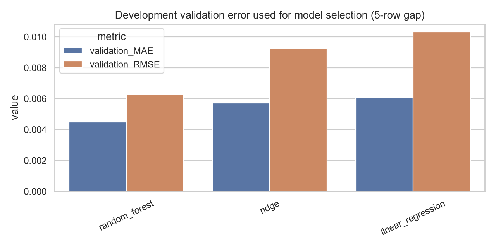
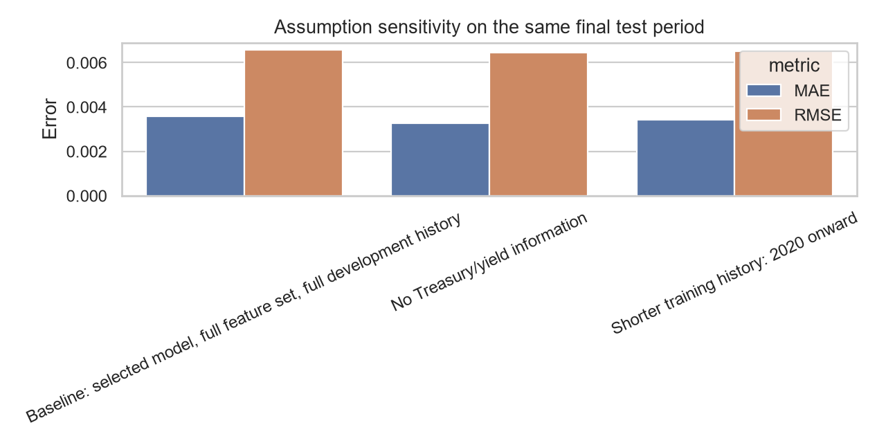

# Volatility Risk Forecast Report

Audience: Portfolio manager / risk manager

## Executive Summary

- The selected model is **random_forest**, chosen using time-aware validation inside the development period only with a five-row purge gap.
- The final test period is kept untouched for model selection. It is used once to compare the selected model with the naive last-observed-volatility benchmark.
- A five-row purge gap prevents overlapping forward target windows from leaking validation/test-period returns into training labels.
- Final-test MAE improvement versus naive is **7.5%** and RMSE improvement is **-3.6%**.
- The tool is useful as a risk-monitoring aid, not an automated trading system. Elevated forecasts should trigger human review.

## Key Charts

This chart compares realized future five-day volatility with the model forecast and the naive persistence baseline on the final test period. It shows whether the model follows the broad volatility regime without claiming exact day-by-day precision.

This chart shows the development-period validation evidence used to choose the model. Each validation fold uses a five-row gap, and the final development/test boundary also purges five rows before the final test start.

This chart compares the baseline specification with two alternative assumptions on the same final test dates: removing Treasury/yield information and training only on more recent post-2020 observations.

## Model Selection and Final Test Results

Development-period validation metrics:

| model | validation_MAE | validation_RMSE | validation_R2 | validation_MAE_std | validation_RMSE_std | folds | selection_rank |
| --- | --- | --- | --- | --- | --- | --- | --- |
| random_forest | 0.004477 | 0.006297 | -0.219457 | 0.001911 | 0.003551 | 5 | 1 |
| ridge | 0.005718 | 0.009238 | -0.973302 | 0.003874 | 0.009158 | 5 | 2 |
| linear_regression | 0.006063 | 0.010320 | -1.310949 | 0.004425 | 0.011332 | 5 | 3 |

Final untouched test metrics:

| model | role | MAE | RMSE | R2 | MAE_improvement_vs_naive | RMSE_improvement_vs_naive |
| --- | --- | --- | --- | --- | --- | --- |
| naive_last_5d_realized_vol | external_benchmark | 0.003855 | 0.006342 | -0.175610 | 0.0% | 0.0% |
| random_forest | selected_by_development_validation | 0.003566 | 0.006571 | -0.262133 | 7.5% | -3.6% |

Final split leakage control: the target uses returns from t+1 through t+5, so the workflow removes the five rows immediately before the final test period from development training. This keeps the intended final-test start date while preventing development labels from using final-test-period returns.

## Assumption Sensitivity

The baseline scenario uses the selected model, the full approved feature set, and the full development training window. Alternative scenarios change one practical assumption at a time while preserving the same final test period.

| scenario | model | feature_count | train_rows | test_rows | test_start | test_end | MAE | RMSE | bias | delta_MAE_vs_baseline | delta_RMSE_vs_baseline | interpretation |
| --- | --- | --- | --- | --- | --- | --- | --- | --- | --- | --- | --- | --- |
| Baseline: selected model, full feature set, full development history | random_forest | 14 | 1713 | 430 | 2024-11-29 | 2026-08-19 | 0.003566 | 0.006571 | -0.001063 | 0.000000 | 0.000000 | Prediction holds if all approved market, volatility, VIX, and Treasury inputs remain available. |
| No Treasury/yield information | random_forest | 10 | 1713 | 430 | 2024-11-29 | 2026-08-19 | 0.003271 | 0.006459 | -0.000381 | -0.000295 | -0.000112 | Tests sensitivity to losing interest-rate levels and yield-spread information. |
| Shorter training history: 2020 onward | random_forest | 14 | 1231 | 430 | 2024-11-29 | 2026-08-19 | 0.003410 | 0.006496 | -0.000587 | -0.000157 | -0.000075 | Tests whether older market regimes are helping or hurting final-test performance. |

Prediction holds if the public market, VIX, and Treasury inputs remain available and the future market regime resembles the development data closely enough. In this run, neither alternative assumption worsens MAE relative to the baseline. That suggests the final-test result is not highly dependent on Treasury/yield features or older pre-2020 training rows, although this should be monitored rather than treated as a permanent economic rule. The model is relatively stable to an assumption when its MAE/RMSE deltas remain small relative to baseline MAE **0.003566**.

## Regime / Subgroup Diagnostics

The following diagnostics ask where the model performs better or worse. They are not the same as assumption sensitivity because the model specification is not changed; the final-test observations are sliced by market conditions.

| subgroup | n | selected_MAE | selected_RMSE | selected_bias | naive_MAE | MAE_improvement_vs_naive |
| --- | --- | --- | --- | --- | --- | --- |
| All final-test observations | 430 | 0.003566 | 0.006571 | -0.001063 | 0.003855 | 7.5% |
| Low/normal VIX regime | 366 | 0.002715 | 0.004224 | -0.000545 | 0.003308 | 17.9% |
| High VIX regime | 64 | 0.008437 | 0.013714 | -0.004024 | 0.006982 | -20.8% |
| High realized-volatility regime | 85 | 0.006646 | 0.012012 | -0.002659 | 0.007612 | 12.7% |

Risk increases when VIX or recent realized volatility is elevated, so the high-stress rows deserve separate review even when average test error is acceptable.

## Bootstrap Uncertainty

Bootstrap selected-model MAE estimate: **0.003566**, 95% CI **[0.003049, 0.004082]** using 1,000 resamples of final-test residual errors.

This interval is useful for communicating uncertainty, but it should be read cautiously because a simple row bootstrap does not fully preserve time-series dependence in daily financial data.

## Assumptions and Risks

- Inputs are daily close-based market indicators available at the prediction date close.
- Treasury yield reporting gaps are forward-filled across market dates; this is reasonable for short holiday gaps but can understate data staleness risk.
- Extreme market observations are retained and flagged rather than deleted because stress periods are decision-relevant.
- The model is predictive, not causal. Coefficients or feature importance should not be read as proof that an input caused volatility.
- Financial regimes change; performance should be monitored with rolling errors, data freshness checks, and stress-regime diagnostics.

## What This Means for You

1. Use the forecast as an early-warning input for daily risk review.
2. Compare the model forecast with the naive baseline before taking action; disagreement is a prompt for analyst review.
3. Give more weight to the signal when VIX and recent realized volatility both point to elevated risk.
4. Do not automate trades from this model. The output supports monitoring, scenario discussion, and escalation.

## Success Criteria Check

- MAE at least 10% better than naive: **NEEDS ATTENTION**
- RMSE at least 5% better than naive: **NEEDS ATTENTION**
- Model selection kept separate from final test evaluation: **PASS**
- Reproducible artifacts generated under `data/processed/`, `model/`, and `reports/`: **PASS**
